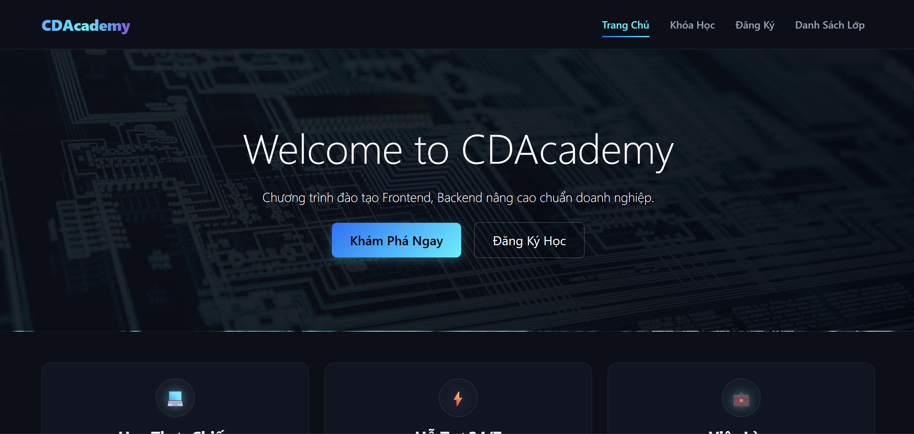

# CDADEMY — WEBSITE GIỚI THIỆU VÀ ĐĂNG KÝ KHÓA HỌC MINI

## 1. Thông tin chung
- **Môn học:** Lập trình Web Frontend
- **Giảng viên hướng dẫn:** ThS. Lê Thanh Thoại
- **Trường:** Đại học Bình Dương — Phân hiệu Cà Mau
- **Hình thức thực hiện:** Cá nhân

## 2. Mô tả dự án
Dự án xây dựng một website tĩnh giới thiệu danh sách các khóa học lập trình Web (Frontend, Backend, Fullstack), hỗ trợ người dùng tìm kiếm theo từ khóa, lọc theo danh mục hoặc cấp độ, xem thông tin chi tiết qua cửa sổ Modal và đăng ký tham gia lớp học trực tuyến. Toàn bộ dữ liệu được quản lý đồng bộ ở Frontend.

## 3. Công nghệ sử dụng
- **Giao diện:** HTML5 , CSS3 
- **Framework:** Bootstrap 5 
- **Xử lý logic:** JavaScript thuần 
- **Lưu trữ dữ liệu:** LocalStorage 
- **Triển khai:** GitHub Pages

## 4. Chức năng chính
- **Trang chủ (`index.html`):** Khối Hero Banner công nghệ, 3 thẻ lợi ích thực chiến và danh sách khóa học nổi bật.
- **Danh sách khóa học (`courses.html`):** Đổ dữ liệu động từ mảng JavaScript, bộ lọc tìm kiếm thời gian thực, xem chi tiết khóa học bằng Bootstrap Modal không tải lại trang.
- **Form đăng ký (`register.html`):** Kiểm tra tính hợp lệ dữ liệu (Validation) thời gian thực và lưu thông tin vào LocalStorage.
- **Danh sách quản lý (`registrations.html`):** Hiển thị danh sách học viên đăng ký dưới dạng bảng, có chức năng xóa từng học viên hoặc xóa toàn bộ danh sách.

## 5. Link demo
- **GitHub Pages:** [Dán link GitHub Pages của bạn vào đây]

## 6. Ảnh giao diện
## 6. Ảnh giao diện
